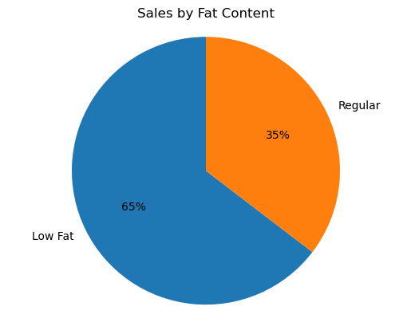
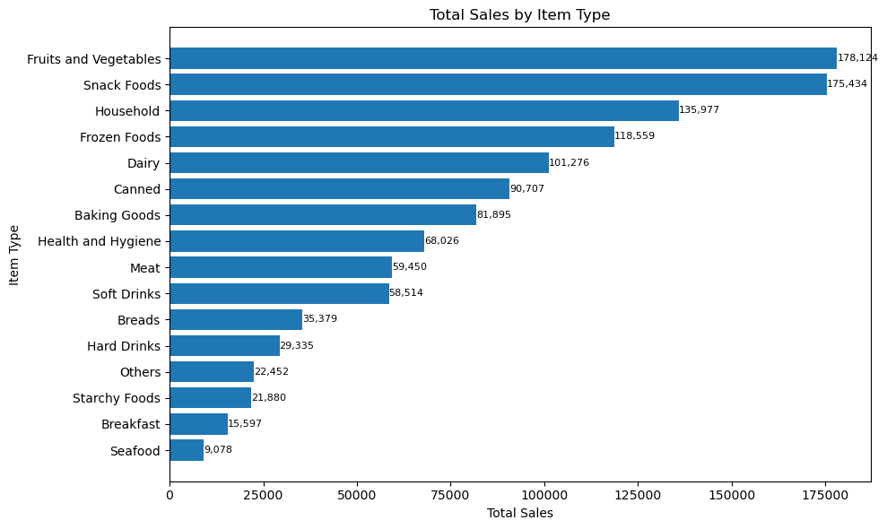
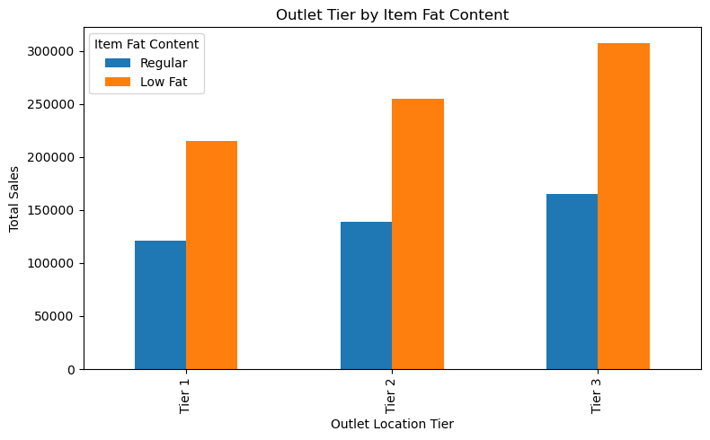
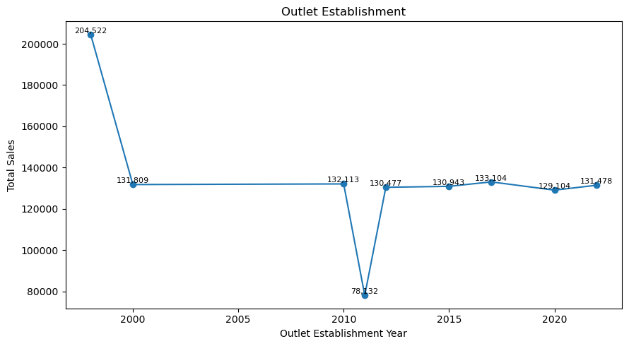
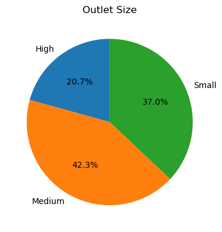
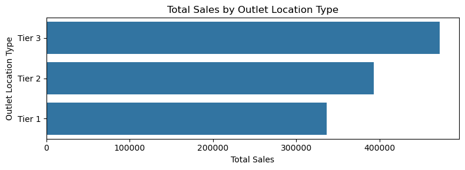

# Blinkit Sales Data Analysis Project

This is a beginner-level data analysis project done using Python. Practiced and guided by [Data Tutorials](https://www.youtube.com/@datatutorials1) on YouTube. The goal is to analyze the sales data of Blinkit, focusing on key business questions and visualizing the results. The dataset contains information about products, outlets, sales, ratings, and other attributes.

## Business Requirment

To conduct a comprehensive analysis of Blinkit's sales performance, customer satisfaction, and inventory distribution to identify key insights and opportunities for optimization using various KPIs and visualizations in Python

## KPI's Requirements

* Total Sales: The overall revenue generated from all items sold.
* Average Sales: The average revenue per sale.
* Number of Items: The total count of different items sold.
* Average Rating: The average customer rating for items sold. 

## Dataset Overview

The dataset contains 8,523 rows and 12 columns, including fields like:

* Item Fat Content

* Item Type

* Outlet Establishment Year

* Outlet Location Type

* Outlet Size

* Sales

* Rating

## Tools & Libraries Used

Pandas and NumPy for data loading and manipulation

Matplotlib and Seaborn for data visualization

## Data Cleaning

There were inconsistencies in the Item Fat Content column such as:

"low fat", "LF" -> standardized to "Low Fat"

"reg" -> standardized to "Regular"

```
# Cleaning Fat Content values
fat_replace = {
    'LF': 'Low Fat',
    'low fat': 'Low Fat',
    'reg': 'Regular'
}
df['Item Fat Content'] = df['Item Fat Content'].replace(fat_replace)
```

## Business KPIs

Calculated metrics:

```
Total Sales:          $1,201,681
Average Sales:        $141
No of Items Sold:     8,523
Average Rating:       4.0
```

## Visualizations & Insights

**1. Sales by Fat Content** 

* Low Fat products contribute 65% of total sales, while Regular items account for 35%.

* This shows that health-conscious choices may be influencing purchasing behavior.

* Recommendation: Focus marketing or stock on Low Fat items



**2. Sales by Item Type**

* Top 3 best-selling product types:

    1. Fruits and Vegetables: 178,124

    2. Snack Foods: 175,434

    3. Household Items: 135,977

* Lowest sales come from Seafood and Breakfast items.

* Suggestion: Consider expanding or promoting lower-performing categories or optimizing inventory for high-sellers.



**3. Sales by Fat Content & Outlet Tier**

* Across **all tiers (Tier 1, 2, 3), Low Fat** items outperform Regular ones in total sales.

* **Tier 3** outlets have the highest sales overall, followed by Tier 2 and Tier 1.

* Suggestion: Target Tier 3 locations with more Low Fat product options or tailored promotions.



**4. Sales by Outlet Establishment Year**

* **Outlets opened in 1998 had the highest total sales** (204,522), while those from **2011 performed the worst.**

* Sales across other years remain steady around 130,000.

* Suggestion: Older outlets may have established customer bases. Explore what’s driving their performance.



**5. Sales by Outlet Size**

* **Medium-sized outlets generate the most sales (42.3%)**, followed by Small (37%) and High (20.7%).

* Medium outlets could be a sweet spot for efficiency and customer volume.

* Suggestion: Prioritize mid-sized outlet expansion or replicate their strategies at other sizes.



**6. Sales by Outlet Location Type**

* **Tier 3** locations had the highest total sales, followed by **Tier 2**, then **Tier 1.**

* This suggests Blinkit is very successful in suburban or rural markets.

* Suggestion: Continue investing in Tier 3 presence and study customer preferences in that segment.



## Summary of Findings

* **Low Fat** products are preferred and contribute 65% of total sales.

* **Fruits & Vegetables** and **Snack Foods** lead all categories in sales.

* **Tier 3 outlet** locations and medium-sized stores drive the highest performance.

* Outlets established in 1998 performed best—may indicate the benefit of long-term presence.

* Overall, product healthiness, outlet size, location type, and store history all affect sales.

## What I Learned

* Data cleaning and replacing inconsistent categorical values

* Grouping and aggregating data to calculate KPIs

* Visualizing sales metrics with pie, bar, and line charts

* How outlet size, location, and product types affect business performance
